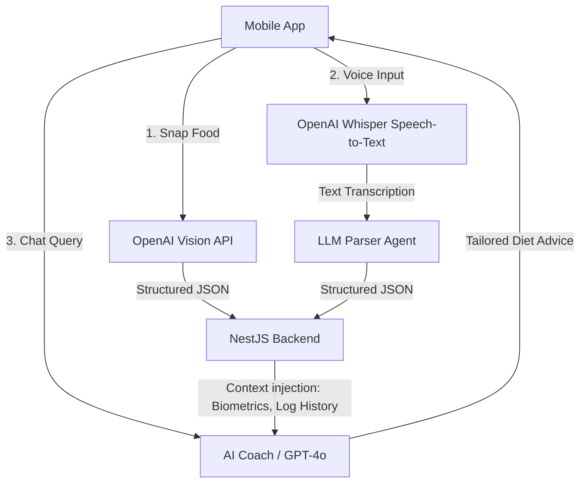

# AI Architecture Specifications - BodyFit AI

BodyFit AI leverages artificial intelligence to simplify logging and personalize health coaching. This document explains the integration flow for Computer Vision, Natural Language Processing, and LLM Coach agents.

---

## 1. AI System Topology



---

## 2. AI Food Recognition (Computer Vision)

When a user snaps a picture of a meal, the mobile client uploads the base64 or binary image. The backend forwards this image to the **OpenAI Vision API (GPT-4o)**.

### System Prompt & Schema Guard
To guarantee deterministic JSON outputs, we invoke OpenAI's structured outputs or set the response format to JSON:

```json
{
  "model": "gpt-4o",
  "response_format": { "type": "json_object" },
  "messages": [
    {
      "role": "system",
      "content": "You are a professional nutritionist. Analyze the food image. Detect the dishes, guess their approximate weights in grams, and calculate total calories, protein, carbs, and fat. Return a JSON object matching this structure: { 'mealDetected': string, 'items': [{ 'name': string, 'weightG': number, 'calories': number }], 'macros': { 'protein': number, 'carbs': number, 'fat': number } }"
    },
    {
      "role": "user",
      "content": [
        { "type": "image_url", "image_url": { "url": "data:image/jpeg;base64,{BASE64_IMAGE_DATA}" } }
      ]
    }
  ]
}
```

---

## 3. Voice Food Logging (Natural Language Processing)

For voice input:
1. The app captures audio using the device microphone.
2. The file is sent to the **Whisper API** for transcription into text (e.g., "I had two fried eggs and a slice of whole wheat toast").
3. The transcribed text is sent to a parser prompt that extracts food quantities and references them against standard nutrient catalogs.

### Parsing Prompt
```text
You are a food logging parser. Extract the food items, portions, and guess their weights from this transcript: "{TRANSCRIPT}". 
Map the items to standard macronutrients. Output a clean JSON array of logs:
[
  { "foodName": "Fried egg", "servingSizeG": 100, "calories": 155, "protein": 13, "carbs": 1, "fat": 11, "mealType": "breakfast" }
]
```

---

## 4. AI Coach Agent (Chat System)

The Coach agent acts as a conversational interface. Rather than being a generic chatbot, it is context-aware:

### Context Injection
When a user asks a question, the backend retrieves:
- **Biometric profile**: e.g., Height: 178cm, Weight: 75kg, Goal: Muscle gain.
- **Log history**: Current daily calories consumed vs remaining target.
- **Recent activity**: Step count from Garmin / Apple Health.

### System Persona Prompt
```text
You are 'Coach Fit', the personal AI Coach of the BodyFit AI app. 
You are speaking with {FIRST_NAME}, who is a {GENDER}, {AGE} years old, weighing {WEIGHT}kg. 
Their goal is: {GOAL}. 
Today they have consumed {CALORIES_EATEN} kcal out of a target of {CALORIES_TARGET} kcal, and burned {CALORIES_BURNED} active kcal.

Guidelines:
1. Keep replies actionable, encouraging, and under 4 sentences.
2. Rely on nutritional science.
3. Incorporate local Vietnamese or cultural dietary context when they ask about specific foods (e.g., Pho, Banh Mi, Bun Bo Hue).
4. Never suggest extreme calorie restriction.
```
