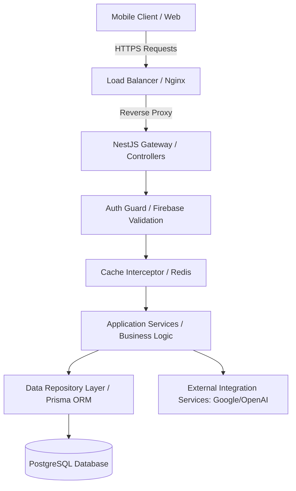
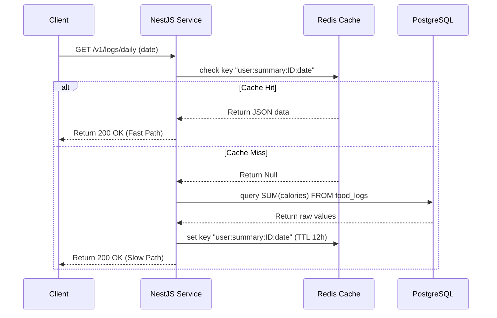

# Backend Architecture Specifications - BodyFit AI

The BodyFit AI backend is designed as a modular, scalable monolithic architecture built with NestJS (TypeScript Node.js framework). This structure supports high development speed, typed interfaces, and clean separation of concerns.

---

## 1. High-Level Backend Layering

---

## 2. Framework Choice: NestJS Architecture

The codebase leverages NestJS's dependency injection system, grouping files by modules:
- **Auth Module**: Validates client-side Firebase JWTs and syncs profiles.
- **Nutrition Module**: Manages entries, logs, and food indexes.
- **AI Module**: Interfaces with external LLMs and Vision APIs.
- **Sync Module**: Integrates step data from wearables.

---

## 3. Database & Caching Topology

### PostgreSQL Connection Pool
We configure TypeORM or Prisma connection pooling to keep db latency low.
- `max_connections`: 100 per server instance.
- `idle_timeout`: 10000ms.

### Cache-Aside (Lazy Loading) Sequence Diagram

---

## 4. Push Notification Engine (Firebase Cloud Messaging)

We leverage Firebase Cloud Messaging (FCM) to trigger background syncs and remind users to hydrate:
1. When a user registers, their device token is uploaded to the backend and saved in `user_profiles`.
2. A CRON job runs at 08:00, 10:00, 12:00, 14:00, 16:00, and 18:00 to query users who have logged less than their target percentage of water.
3. FCM notifications are dispatched in parallel batches using `firebase-admin` SDK.

---

## 5. Security & Rate Limiting

- **Cors Configuration**: Locked down to authorized domains (`app://bodyfit-ai`, localhost).
- **Helmet**: Set custom headers to prevent XSS.
- **Rate Limiters**: NestJS Throttler module throttles client requests (e.g. max 100 standard requests / minute, 5 AI requests / minute) using Redis counters to prevent server overload.
