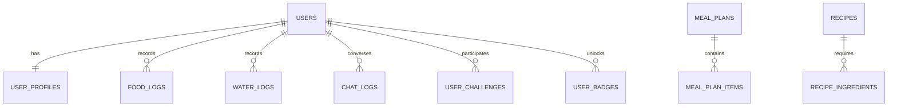

# Database Schema Design - BodyFit AI

## 1. PostgreSQL Schema Definition

BodyFit AI utilizes PostgreSQL for structured, relational, transactional data. Below are the key tables, data types, indexes, and constraints.



### Table: `users`
Stores core authentication and account details.
```sql
CREATE TABLE users (
    id UUID PRIMARY KEY DEFAULT gen_random_uuid(),
    email VARCHAR(255) UNIQUE NOT NULL,
    password_hash VARCHAR(255), -- NULL if social sign-in only
    auth_provider VARCHAR(50) DEFAULT 'email', -- 'email', 'google', 'apple', 'facebook'
    firebase_uid VARCHAR(128) UNIQUE NOT NULL,
    created_at TIMESTAMP WITH TIME ZONE DEFAULT CURRENT_TIMESTAMP,
    updated_at TIMESTAMP WITH TIME ZONE DEFAULT CURRENT_TIMESTAMP
);
CREATE INDEX idx_users_firebase_uid ON users(firebase_uid);
```

### Table: `user_profiles`
Stores biometrics, goals, and daily thresholds.
```sql
CREATE TABLE user_profiles (
    user_id UUID PRIMARY KEY REFERENCES users(id) ON DELETE CASCADE,
    first_name VARCHAR(100),
    last_name VARCHAR(100),
    date_of_birth DATE NOT NULL,
    gender VARCHAR(20) CHECK (gender IN ('male', 'female', 'other')),
    height_cm NUMERIC(5,2) NOT NULL,
    weight_kg NUMERIC(5,2) NOT NULL,
    activity_level VARCHAR(50) CHECK (activity_level IN ('sedentary', 'lightly_active', 'moderately_active', 'very_active', 'athlete')),
    target_goal VARCHAR(50) CHECK (target_goal IN ('weight_loss', 'weight_gain', 'maintain_weight', 'muscle_gain', 'healthy_lifestyle')),
    
    -- Calculated Targets
    bmi NUMERIC(4,2),
    bmr NUMERIC(6,2),
    tdee NUMERIC(6,2),
    target_calories INTEGER NOT NULL,
    target_protein_g INTEGER NOT NULL,
    target_carbs_g INTEGER NOT NULL,
    target_fat_g INTEGER NOT NULL,
    target_water_ml INTEGER DEFAULT 2000,
    
    xp INTEGER DEFAULT 0,
    level INTEGER DEFAULT 1,
    created_at TIMESTAMP WITH TIME ZONE DEFAULT CURRENT_TIMESTAMP,
    updated_at TIMESTAMP WITH TIME ZONE DEFAULT CURRENT_TIMESTAMP
);
```

### Table: `food_logs`
Records consumed food items for the macro trackers.
```sql
CREATE TABLE food_logs (
    id UUID PRIMARY KEY DEFAULT gen_random_uuid(),
    user_id UUID NOT NULL REFERENCES users(id) ON DELETE CASCADE,
    meal_type VARCHAR(20) NOT NULL CHECK (meal_type IN ('breakfast', 'lunch', 'dinner', 'snack')),
    food_name VARCHAR(255) NOT NULL,
    serving_size_g NUMERIC(6,2) NOT NULL,
    calories INTEGER NOT NULL,
    protein_g NUMERIC(5,2) DEFAULT 0,
    carbs_g NUMERIC(5,2) DEFAULT 0,
    fat_g NUMERIC(5,2) DEFAULT 0,
    logged_date DATE NOT NULL DEFAULT CURRENT_DATE,
    logged_at TIMESTAMP WITH TIME ZONE DEFAULT CURRENT_TIMESTAMP
);
CREATE INDEX idx_food_logs_user_date ON food_logs(user_id, logged_date);
```

### Table: `water_logs`
Tracks hydration details.
```sql
CREATE TABLE water_logs (
    id UUID PRIMARY KEY DEFAULT gen_random_uuid(),
    user_id UUID NOT NULL REFERENCES users(id) ON DELETE CASCADE,
    amount_ml INTEGER NOT NULL CHECK (amount_ml > 0),
    logged_date DATE NOT NULL DEFAULT CURRENT_DATE,
    logged_at TIMESTAMP WITH TIME ZONE DEFAULT CURRENT_TIMESTAMP
);
CREATE INDEX idx_water_logs_user_date ON water_logs(user_id, logged_date);
```

### Table: `chat_logs`
Saves interaction threads with the AI nutrition coach.
```sql
CREATE TABLE chat_logs (
    id UUID PRIMARY KEY DEFAULT gen_random_uuid(),
    user_id UUID NOT NULL REFERENCES users(id) ON DELETE CASCADE,
    sender VARCHAR(20) NOT NULL CHECK (sender IN ('user', 'coach')),
    message TEXT NOT NULL,
    sent_at TIMESTAMP WITH TIME ZONE DEFAULT CURRENT_TIMESTAMP
);
CREATE INDEX idx_chat_logs_user_sent ON chat_logs(user_id, sent_at);
```

---

## 2. Redis Caching Strategy

To achieve sub-50ms API loads and optimize API rate limits, Redis is deployed as an in-memory cache and volatile message store.

### Cache Key Namespaces & Config

#### A. User Target Cache
- **Key Pattern**: `user:profile:{userId}`
- **Value**: JSON representation of `user_profiles` calculations.
- **TTL**: 24 hours (`86400` seconds).
- **Invalidation**: Cleared/updated whenever user saves modifications to biometrics.

#### B. Daily Summary Cache
- **Key Pattern**: `user:summary:{userId}:{date_YYYY-MM-DD}`
- **Value**: Accumulated macros (Calories, Protein, Carbs, Fat, Water) logged today.
- **TTL**: 12 hours.
- **Invalidation**: Evicted on any write to `food_logs` or `water_logs` for that specific day.

#### C. Nutrition Database Search Cache
- **Key Pattern**: `food:search:{query}`
- **Value**: JSON array of matching food objects.
- **TTL**: 7 days.
- **Eviction**: Least Recently Used (LRU).

#### D. Session & Rate Limiter Cache
- **Key Pattern**: `rate:ai:{userId}`
- **Value**: Integer counter for AI API request throttles (e.g. max 30 chat queries per hour).
- **TTL**: 1 hour.
