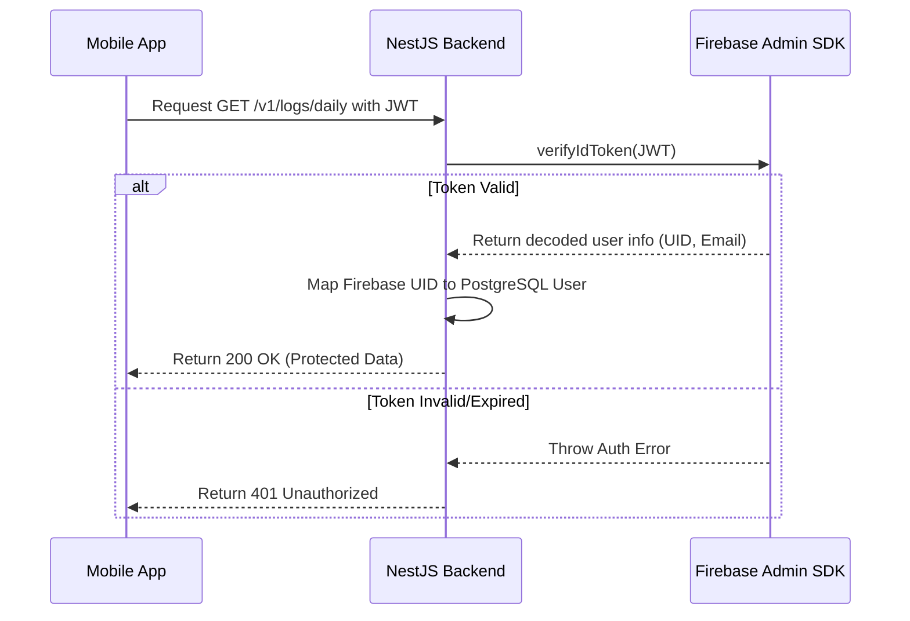

# Firebase Configuration Specifications - BodyFit AI

BodyFit AI utilizes Firebase for low-latency client-side Authentication, Cloud Storage (for raw meal uploads), and Firebase Cloud Messaging (FCM) for push notifications.

---

## 1. Firebase Authentication Setup

### Allowed Sign-In Providers
1. **Email & Password**: Standard registration; verifies email address upon completion of survey.
2. **Google Sign-In**: Interfaced using `expo-auth-session/providers/google`. Requires Client IDs for iOS, Android, and Web.
3. **Apple Sign-In**: Essential for App Store compliance. Handled via `expo-apple-authentication`.
4. **Facebook Login**: Utilizes standard OAuth tokens.

### JWT Token Verification Flow (Backend integration)
When the mobile client authenticates, it receives an ID Token (`JWT`). It attaches this token to the `Authorization` header of all requests.



---

## 2. Firebase Cloud Storage Structure

Used to securely hold raw images of scanned dishes before forwarding to the OpenAI Vision API.

### Storage Bucket Rules
To protect user privacy and prevent unauthorized hotlinking:
```javascript
rules_version = '2';
service firebase.storage {
  match /b/{bucket}/o {
    match /users/{userId}/meals/{allPaths=**} {
      // Allow read/write only if the authenticated user owns the subfolder
      allow read, write: if request.auth != null && request.auth.uid == userId;
    }
  }
}
```

### Path Conventions
- Path: `users/{userId}/meals/{date}_{timestamp}.jpg`
- Content Type: `image/jpeg`
- Metadata tags: `{ "device": "iOS", "detectedMeal": "Pending" }`
- Lifecycle Policy: Set a storage lifecycle policy to delete items older than 30 days automatically to minimize hosting costs.

---

## 3. Firebase Cloud Messaging (FCM) Configuration

### Certificates Configuration
- **iOS APNs Integration**: Convert Apple Developer APNs Auth Key (`.p8`) and upload to Firebase Console project settings.
- **Android Integration**: Google Play Services handle tokens natively.

### Payload Structure for Hydration Alert
Dispatched by the cron service to nudge users:
- **Header**: `Content-Type: application/json`
- **Request Body**:
  ```json
  {
    "message": {
      "token": "d8x8a923-d3ac-...",
      "notification": {
        "title": "Time to Hydrate! 💧",
        "body": "You have consumed 1,250ml today. Drink 250ml more to meet your afternoon goal!"
      },
      "data": {
        "screen": "journal",
        "action": "open_water_tracker"
      },
      "android": {
        "priority": "high"
      },
      "apns": {
        "payload": {
          "aps": {
            "sound": "default"
          }
        }
      }
    }
  }
  ```
- Android/iOS clients listen to background events and redirect the user directly to the water log panel.
