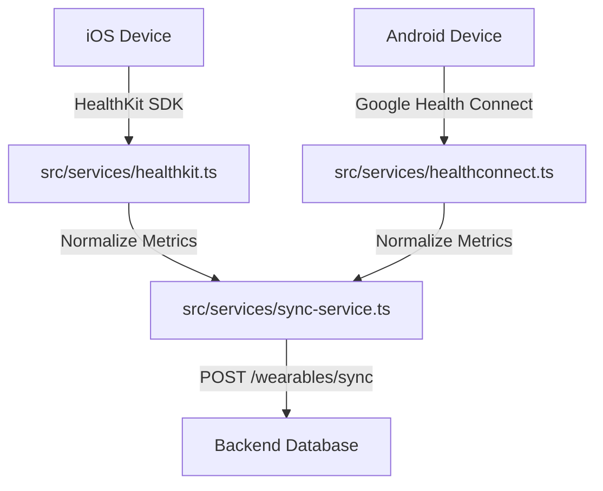

# Mobile Architecture Specifications - BodyFit AI

The frontend client is built on **React Native** (v0.85) utilizing **Expo** (v56) for accelerated build speeds, cross-platform stability, and access to native hardware features like the camera (AI scan) and secure health sensors.

---

## 1. Directory Structure Blueprint

The mobile app follows a feature-modular pattern inside the `/src` folder:
- **`/app`**: Contains the Expo Router file-based pages (tabs, screens, modals).
- **`/components`**: Reusable visual components divided by functionality (cards, trackers, buttons, modals).
- **`/constants`**: Visual styles, scale variables, and color mappings.
- **`/hooks`**: Custom state management, query, and hardware hooks.
- **`/services`**: Modules interfacing with the REST API, Local DB (AsyncStorage), and Device Sensors.

---

## 2. Navigation Flow

Expo Router structures the navigation stack:
- **`src/app/_layout.tsx`**: Sets up root contexts (Theme, Authentication) and manages the splash overlay.
- **`src/app/onboarding.tsx`**: Linear setup wizard capturing user variables.
- **`src/app/index.tsx`**: Redirects unauthenticated users to onboarding, otherwise opens the main workspace.
- **`src/app/(tabs)`**: The primary workspace containing five tab-triggers:
  1. `index` -> Home Dashboard
  2. `journal` -> Daily Calorie & Water Logs
  3. `coach` -> Interactive AI chatbot
  4. `analytics` -> Progress reports and charts
  5. `settings` -> Profile details and configurations

---

## 3. Theme & Colors Management

The system respects OS-level dark/light modes using the native `useColorScheme` hook:
- Global colors are imported from `src/constants/theme.ts`.
- Components use `ThemedText` and `ThemedView` wrappers to automatically adapt backgrounds and fonts:
```typescript
import { Colors } from '@/constants/theme';
import { useColorScheme } from 'react-native';

export function useTheme() {
  const scheme = useColorScheme();
  return Colors[scheme === 'dark' ? 'dark' : 'light'];
}
```

---

## 4. Wearable Integration (Health SDKs)

To sync step and heart rate data, BodyFit AI wraps native platform APIs:



### iOS HealthKit Integration
Interfaced through `react-native-health` or Expo config plugins.
- Permissions requested: `ActiveEnergyBurned`, `BasalEnergyBurned`, `Steps`, `HeartRate`, `SleepAnalysis`.
- Sync frequency: Dispatched on app wake/resume.

### Android Health Connect Integration
Google Health Connect API is triggered via native bindings.
- Request permissions for Read/Write steps and active calories.
- Fallback to Garmin Connect API OAuth flow for users who use Garmin watches.

---

## 5. Offline Data & Synchronization

- **AsyncStorage**: Caches the user's daily journal and target calories locally. If a user logs food while offline, the entry is queued.
- **Queue Manager Hook**: Runs on app startup or network state changes (using `@react-native-community/netinfo`). It pushes local queued entries to `POST /logs/food` when connection resumes.
