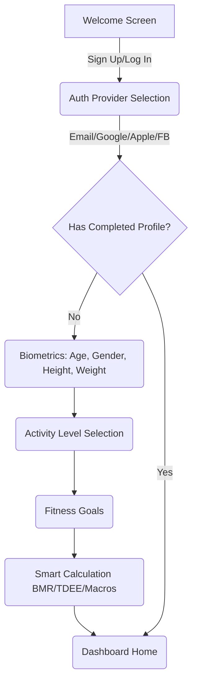

# UI/UX Wireframe & Design Specifications - BodyFit AI

## 1. Visual Identity & Brand System

### Design Language
- **Material Design 3 (MD3)**: Utilizing standardized surfaces, rounded shapes, micro-interactions, dynamic light/dark palettes, and bold typography.
- **Glassmorphism**: Selected overlays (e.g., nutrition breakdowns, chat bars, camera HUDs) feature an elegant semi-transparent background (`rgba(255, 255, 255, 0.15)` for light / `rgba(33, 34, 37, 0.7)` for dark) with a Gaussian blur radius of `15px` and light border borders.
- **Micro-Animations**: Smooth scale transitions on button presses, fading loading rings, expand/collapse list states via `react-native-reanimated`.

### Brand Color Palette
- **Primary Green**: `#22C55E` (Vibrant emerald green, representing vitality, health, and clean eating)
- **Secondary Green**: `#16A34A` (Medium-dark green, used for focused elements and gradients)
- **Accent Teal**: `#10B981` (Bright minty teal, used for success metrics, badges, and progress rings)
- **Neutral Dark**: `#0D0E12` (Main dark mode background, avoiding pure black for softer contrast)
- **Neutral Light**: `#F8FAFC` (Main light mode background, clean slate blue-gray)

---

## 2. Component System Reference

### A. Glassmorphic Nutrition Card
```
+-------------------------------------------------------+
|  Today's Progress (Calorie Goal: 2,200 kcal)           |
|                                                       |
|   [ 1,450 kcal Eaten ] -------------> [ 750 kcal Left] |
|   ==============================[======] (65% filled) |
|                                                       |
|   Protein: 110g/150g   Carbs: 180g/250g   Fat: 42g/65g|
|   [====.....]          [========..]       [======...] |
+-------------------------------------------------------+
```
- **Styling**: `borderRadius: 20`, `padding: 16`, `borderWidth: 1`, `borderColor: '#E2E8F0'` (light) or `'#334155'` (dark). Overlay blur filter.

### B. Hydration Progress Ring
- Radial SVG ring featuring a clean gradient sweep from Primary `#22C55E` to Accent `#10B981`.
- Center text shows the absolute current intake (e.g., `1,250 / 2,500 ml`) and percent completion (`50%`).

### C. Conversational Coach Chat Bubble
- **User Message Bubble**: Aligned right, solid Primary `#22C55E` background with white text, `borderTopLeftRadius: 18`, `borderTopRightRadius: 4`, `borderBottomLeftRadius: 18`, `borderBottomRightRadius: 18`.
- **Coach Message Bubble**: Aligned left, glassmorphic surface, tinted text color (Primary tint in dark/light mode), `borderTopLeftRadius: 4`, `borderTopRightRadius: 18`, `borderBottomLeftRadius: 18`, `borderBottomRightRadius: 18`.

---

## 3. Onboarding & Registration User Flow



---

## 4. Screen Layout Mockups (Wireframes)

### Screen A: Onboarding Slider (Personalization)
1. **Slide 1**: Welcome text + Logo + OAuth buttons (Google, Apple, Facebook, Email).
2. **Slide 2**: Biometrics Picker (Age slider, Height scroll wheel, Weight weight metrics).
3. **Slide 3**: Activity level cards with detailed descriptions (e.g., "Sedentary - desk job, little exercise").
4. **Slide 4**: Target Goal selector cards (Weight Loss, Muscle Gain, Maintain, Healthy Life).
5. **Slide 5**: Summary page showing calculated BMI, BMR, TDEE, and daily targets, with a large "Let's Begin" primary CTA.

### Screen B: Main Dashboard (Home Tab)
- **Header**: Calendar date slider (horizontal weekly list), notifications bell, profile picture.
- **Top Card**: Glassmorphic Calorie progress banner with macronutrient rings.
- **Middle Grid (Quick Actions)**:
  - Add Water button
  - Scan Barcode button
  - Snap Dish (AI Recognition) button
  - Voice Logging microphone button
- **Bottom Section**: Wearable health data panel showing current steps count, active calories burned, and sleep rating.

### Screen C: Food Journal (Journal Tab)
- Dynamic list with sections for **Breakfast**, **Lunch**, **Dinner**, and **Snacks**.
- Each section displays logged dishes, calorie count, and macros.
- Swiping left on an entry reveals **Edit** and **Delete** actions.
- Floating Action Button (FAB) at the bottom-right corner triggers the search page, camera scanner, or voice log.

### Screen D: AI Nutrition Coach (Coach Tab)
- Instant conversational window.
- Suggestion chips at the top for quick queries ("What should I eat post-workout?", "Assess my dinner calories").
- Scrolling thread of historical chats, loaded securely from the PostgreSQL backend.
- Message input field featuring custom mic triggers (Voice parsing) and camera shortcuts.
